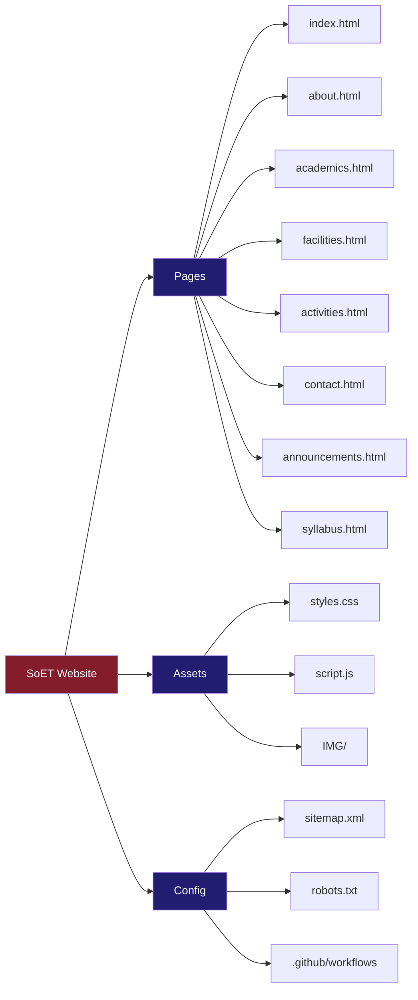
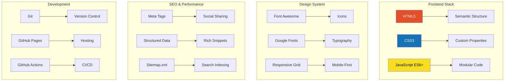

# SoET Official Website

School of Engineering and Technology | Samrat Vikramaditya Vishwavidyalaya Ujjain

Excellence in Engineering Education Since 1957

## Overview

Modern, responsive, and SEO-optimized official website for the School of Engineering and Technology at Samrat Vikramaditya Vishwavidyalaya, Ujjain. Built with cutting-edge web technologies focusing on user experience, accessibility, and performance.

**Quick Links**: [Features](#features) | [Getting Started](#getting-started) | [Contact](#contact)

## Features

### Design and User Experience
- Fully Responsive: Seamless experience across all devices
- Modern UI/UX: Clean, professional design with smooth animations
- Fast Loading: Optimized assets for quick page loads
- Accessible: WCAG 2.1 AA compliant

### Core Functionality
- 8 Pages: Complete information architecture
- Interactive Elements: Forms, tabs, and dynamic content
- SEO Optimized: Meta tags, sitemap, and structured data
- CI/CD Ready: GitHub Actions workflow included

## Architecture

The website follows a simple three-tier frontend architecture:

**Frontend Layer**
- HTML5: Semantic structure and accessibility
- CSS3: Modern styling with custom properties
- JavaScript ES6+: Interactive features and animations

**Features Layer**
- 8 HTML pages for complete information
- Responsive design adapting to all screen sizes
- Smooth animations and interactive forms

**Deployment**
- Hosted on GitHub Pages
- Automated deployment via GitHub Actions

## Getting Started

### Prerequisites
- Any modern web browser (Chrome, Firefox, Safari, Edge)
- Python 3.x for local server (optional)

### Quick Start

**Option 1: Python HTTP Server (Recommended)**

```bash
git clone https://github.com/Saurabhyadavastro/SoET-Official-Website.git
cd SoET-Official-Website
python -m http.server 8000
```

Then visit http://localhost:8000 in your browser.

**Option 2: Direct File Access**

Simply open index.html in your web browser.

## Project Structure



## Technology Stack

**Frontend**
- HTML5: Semantic structure
- CSS3: Custom properties and modern styling
- JavaScript ES6+: Modular, interactive code

**Design**
- Font Awesome: Icon library
- Google Fonts: Poppins typography
- Responsive Grid: Mobile-first approach

**SEO and Performance**
- Meta tags for social sharing
- Structured data for rich snippets
- XML sitemap for search indexing

**Development Tools**
- Git: Version control
- GitHub Pages: Hosting
- GitHub Actions: Automated deployment



- GitHub Actions: Automated deployment

## Page Structure

**Website Pages**
- index.html: Homepage with hero section and quick stats
- about.html: History, mission, vision, leadership
- academics.html: Programs, courses, departments
- facilities.html: Labs, library, campus infrastructure
- activities.html: Cultural, technical, sports events
- contact.html: Contact forms and location
- announcements.html: Latest news and updates
- syllabus.html: Course syllabi and resources

- syllabus.html: Course syllabi and resources

## Design System

**Color Palette**
- Primary Red: #841C2C (headings and accents)
- Primary Blue: #211D70 (text and navigation)
- Background Cream: #FFE8BF (page backgrounds)
- Text Black: #000000 (body text)
- White: #FFFFFF (clean backgrounds)

**Typography**
- Primary Font: Poppins from Google Fonts
- Weights: Light (300), Regular (400), Semi-Bold (600), Bold (700)
- Fallback: Arial, sans-serif

## Development Workflow

**Local Development**

```bash
python -m http.server 8000
```

Access the website at http://localhost:8000

**Deployment Process**
1. Push code to GitHub repository
2. GitHub Actions automatically triggers
3. Website deploys to GitHub Pages

3. Website deploys to GitHub Pages

## Key Features

**Responsive Design**
- Mobile-first approach
- Breakpoints: 320px, 768px, 1024px, 1440px
- Touch-friendly interface

**Accessibility**
- WCAG 2.1 AA compliant
- Semantic HTML structure
- ARIA labels and roles
- Keyboard navigation support

**Performance**
- Optimized images
- Minified CSS and JS in production
- Lazy loading
- Fast page loads (under 2 seconds)

**SEO**
- Meta tags on all pages
- Open Graph tags
- Structured data markup
- XML sitemap
- Robots.txt configuration

## Deployment

**Current Hosting: GitHub Pages**

Automatic deployment is configured via GitHub Actions. Every push to the main branch triggers a deployment.

**Alternative Hosting Options**
- Netlify: Drag and drop deployment
- Vercel: Connect GitHub repository
- Apache or Nginx: Traditional web server
- AWS S3: Static hosting with CloudFront

## Browser Support

| Browser | Version | Support |
|---------|---------|---------|
| Chrome | 90+ | Full |
| Firefox | 88+ | Full |
| Safari | 14+ | Full |
| Edge | 90+ | Full |
| Opera | 76+ | Full |

## Contributing

**How to Contribute**

1. Fork the repository
2. Clone your fork
3. Create a feature branch
4. Make your changes
5. Commit and push
6. Open a Pull Request

**Code Style**
- Use semantic HTML5 elements
- Follow BEM CSS methodology
- Write modular JavaScript functions
- Add JSDoc comments for functions
- Use 2 spaces for indentation

## Contact and Support

**School of Engineering and Technology**

Samrat Vikramaditya Vishwavidyalaya, Ujjain (M.P.)

Email: soet@vikramuniv.ac.in
Phone: +91 734-2514271
Website: vikramuniv.ac.in
Address: Samrat Vikramaditya Vishwavidyalaya, Dewas Road, Ujjain - 456010

**Project Maintainer**

GitHub: @Saurabhyadavastro
Repository: github.com/Saurabhyadavastro/SoET-Official-Website

## License

This project is licensed under the MIT License. See LICENSE file for details.

## Acknowledgments

Samrat Vikramaditya Vishwavidyalaya: For academic excellence and support
SoET Faculty: For guidance and feedback
Students: For valuable input and testing
Open Source Community: For tools and resources

---

Made for School of Engineering and Technology, Samrat Vikramaditya Vishwavidyalaya, Ujjain
